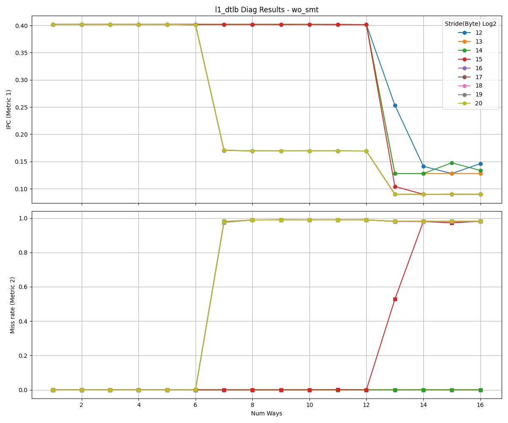
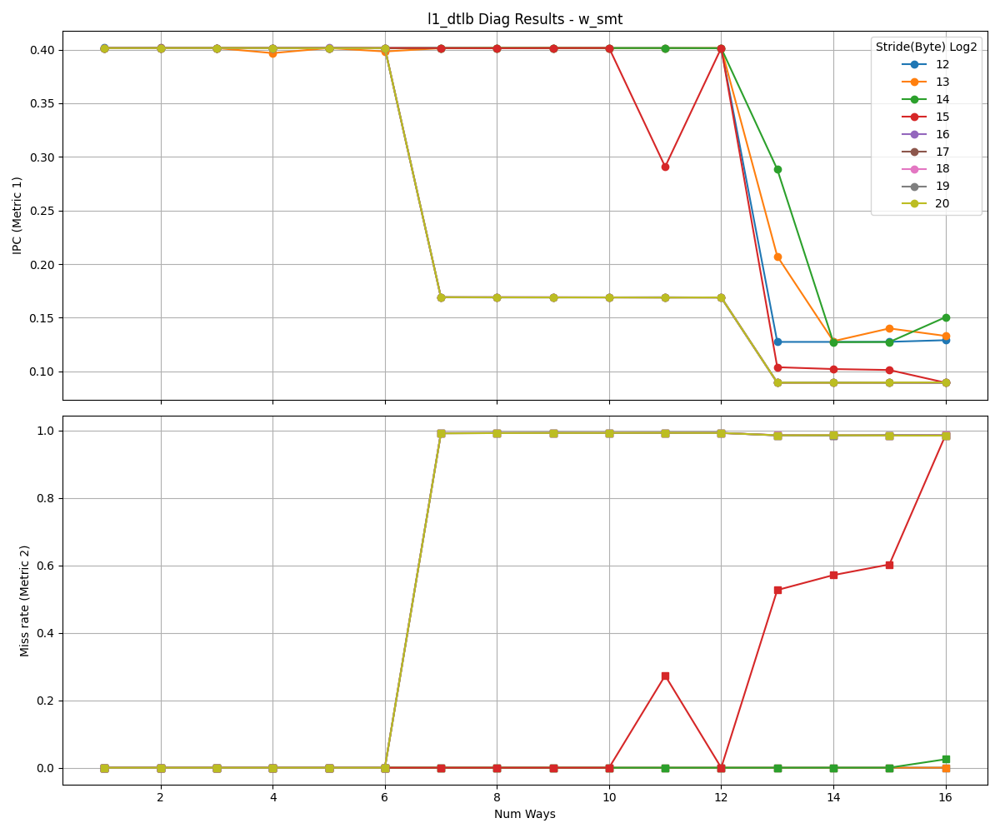

# L1 Data TLB Analysis

This document presents the reverse-engineering results for the L1 data TLB.

<table>
  <tr>
    <td></td>
    <td></td>
  </tr>
</table>

## Observations

- As the stride increases, the address bits used for set indexing shift to higher positions. When the stride exceeds the set index range, all accesses map to the same set, causing the performance curves to converge.
- In these results, curves converge at stride 2^16, so the MSB of the set index is at bit position **15** (0-indexed).
- Based on 4KB pages, we exclude the 12-bit page offset, leaving **4 bits** for the set index.
- Therefore, the L1 DTLB has **16 sets**.
- TLB misses begin to increase when the number of ways exceeds 6, indicating **6-way** associativity.
- Since the results are similar with and without SMT, the L1 DTLB uses **competitive sharing**.

---

**NOTE**
- While IPC can be used for reverse-engineering, hardware-specific events can remove the impact of other resources.
- Metric 2 uses DTLB Miss events and shows results similar to the IPC drop pattern.