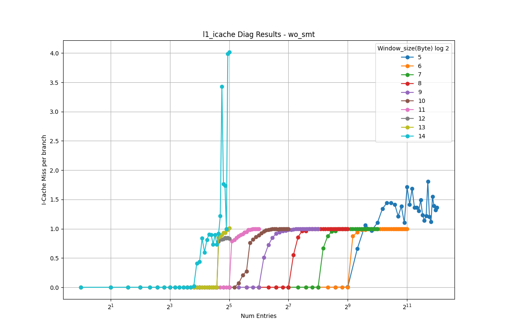
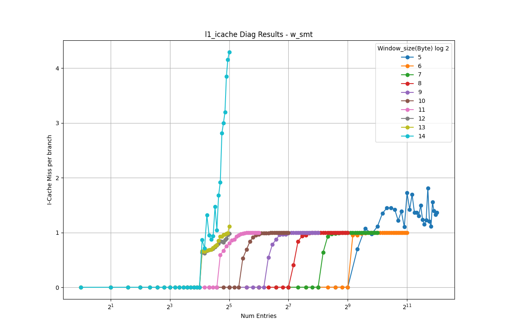

# L1 Instruction Cache Analysis

This document presents the reverse-engineering results for the L1 instruction cache.

<table>
  <tr>
    <td></td>
    <td></td>
  </tr>
</table>

## Observations

- As the stride increases, the address bits used for set indexing shift to higher positions. When the stride exceeds the set index range, all accesses map to the same set, causing the performance curves to converge.
- In these results, curves converge at stride 2^12, so the MSB of the set index is at bit position **11** (0-indexed).
- Since the cache block size is 64 bytes, we exclude the 6-bit block offset, leaving **6 bits** for the set index.
- Therefore, the L1 instruction cache has **64 sets**.
- With a total of 512 entries, the associativity is **512/64 = 8 ways**.
- Since the results are similar with and without SMT, the L1 instruction cache uses **competitive sharing**.

---

**NOTE**
- The frontend has latency-hiding mechanisms (e.g., instruction buffer), making it difficult to reverse-engineer using only IPC.
- Therefore, we use the generic PMU event `icache_miss` to measure instruction cache misses.
- The reason misses don't increase at 8 entries is likely due to the uop cache or prefetching mechanisms.