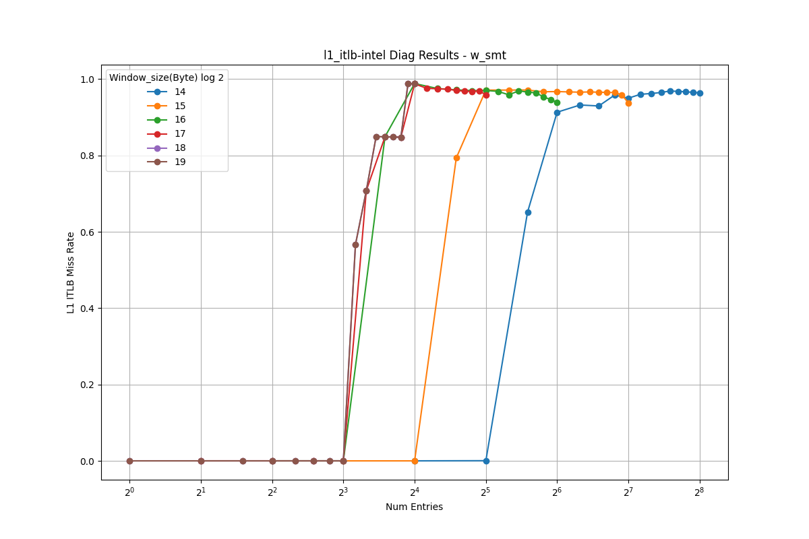

# L1 Instruction TLB Analysis (Intel)

This document presents the reverse-engineering results for the L1 instruction TLB.

<table>
  <tr>
    <td></td>
    <td></td>
  </tr>
</table>

## Observations

- As the stride increases, the address bits used for set indexing shift to higher positions. When the stride exceeds the set index range, all accesses map to the same set, causing the performance curves to converge.
- In these results, curves converge at stride 2^17, so the MSB of the set index is at bit position **16** (0-indexed).
- Based on 4KB pages, we exclude the 12-bit page offset, leaving **5 bits** for the set index.
- Therefore, the L1 ITLB has **32 sets**.
- TLB misses begin to increase when the number of ways exceeds 8, indicating **8-way** associativity.
- Since the capacity with SMT is exactly half of the full capacity, the L1 ITLB uses **static partitioning**.

---

**NOTE**
- The frontend has latency-hiding mechanisms (e.g., instruction buffer), making it difficult to reverse-engineer using only IPC.
- The generic PMU event for L1 ITLB miss only counts cases that also miss in the L2 STLB, making it unsuitable for L1 ITLB reverse-engineering.
- Therefore, we use Intel-specific PMU events that directly measure L1 ITLB misses.