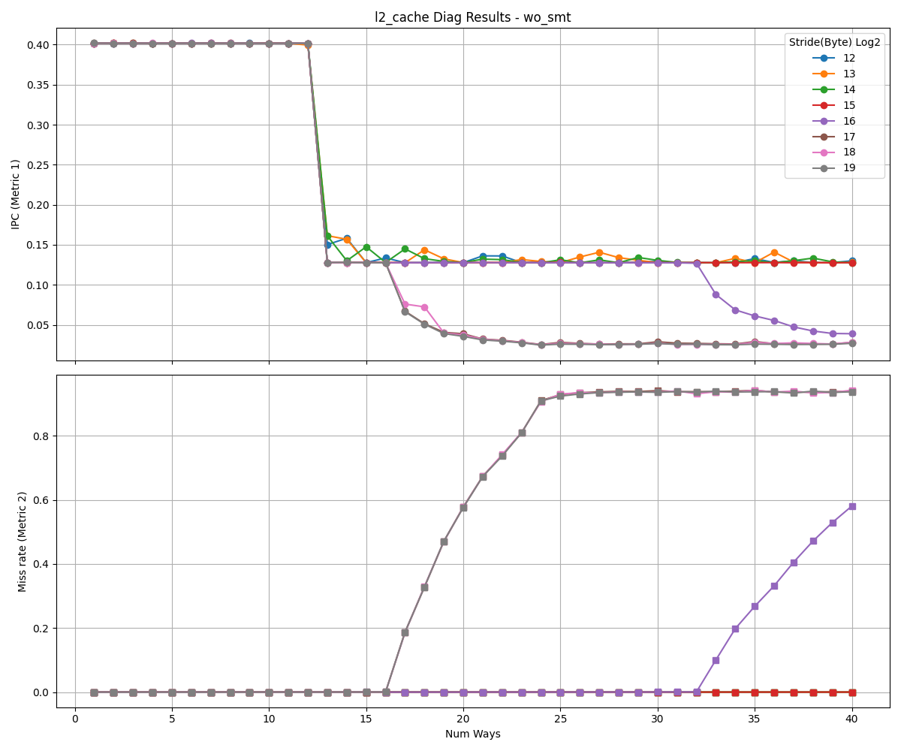
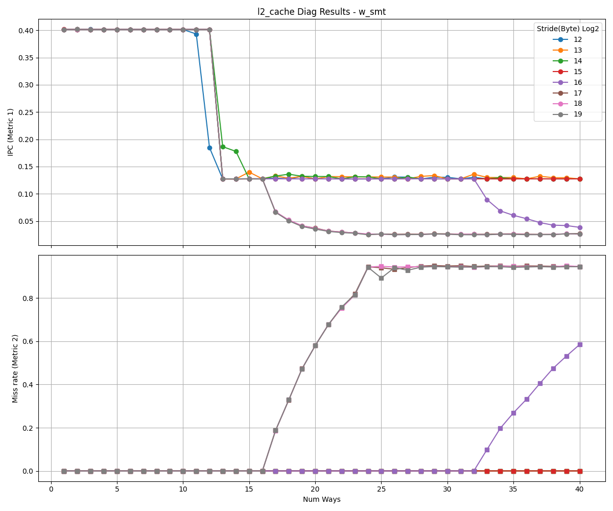

# L2 Cache Analysis

This document presents the reverse-engineering results for the L2 cache.

<table>
  <tr>
    <td></td>
    <td></td>
  </tr>
</table>

## Observations

- As the stride increases, the address bits used for set indexing shift to higher positions. When the stride exceeds the set index range, all accesses map to the same set, causing the performance curves to converge.
- In these results, curves converge at stride 2^17, so the MSB of the set index is at bit position **16** (0-indexed).
- Since the cache block size is 64 bytes, we exclude the 6-bit block offset, leaving **11 bits** for the set index.
- Therefore, the L2 cache has **2048 sets**.
- Cache misses begin to increase when the number of ways exceeds 16, indicating **16-way** associativity.
- Since the results are similar with and without SMT, the L2 cache uses **competitive sharing**.

---

**NOTE**
- While IPC can be used for reverse-engineering, hardware-specific events can remove the impact of other resources.
- Metric 2 uses L2_CACHE_MISS events and shows results similar to the IPC drop pattern.
- The drop occurring at 12 ways is due to the influence of the L1 data cache.
- If the L1 data cache has more ways than the L2 cache, the `num_sets` parameter in the L2 cache diagnostic should be adjusted accordingly.