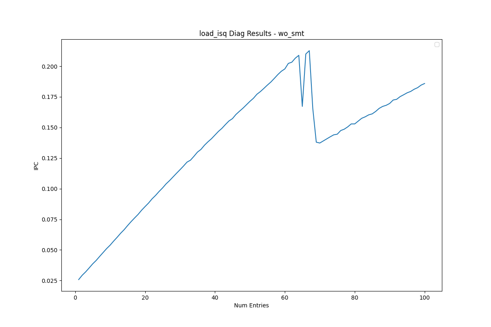
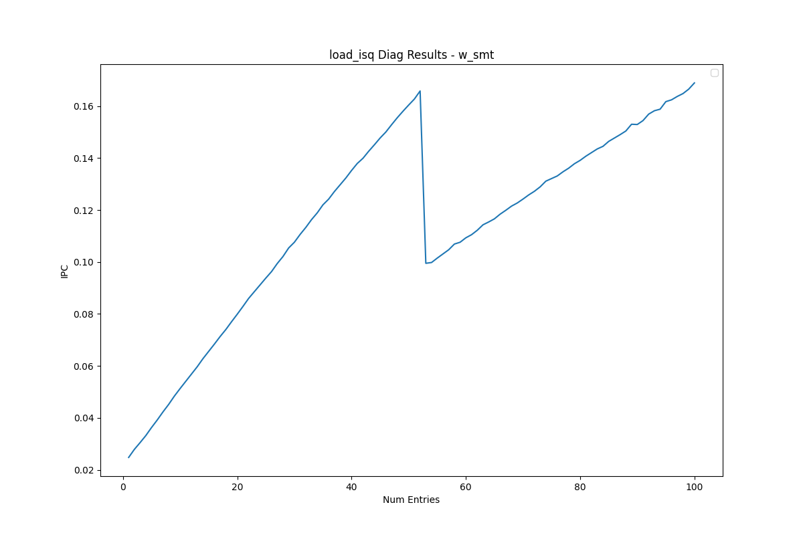

# Load Issue Queue Analysis

This document presents the reverse-engineering results for the load issue queue.

<table>
  <tr>
    <td></td>
    <td></td>
  </tr>
</table>

## Observations

- As shown in the plots above, the performance drop occurs at **70 entries** without SMT, and at **53 entries** with SMT.
- Since the drop point falls between half and full capacity, this indicates **dynamic partitioning**.
- Based on these results, the load issue queue has a total size of **70 entries** with a watermark size of **17 entries**.