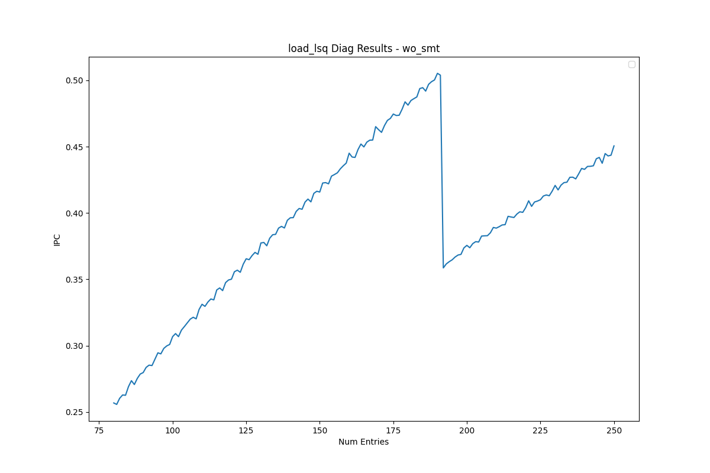
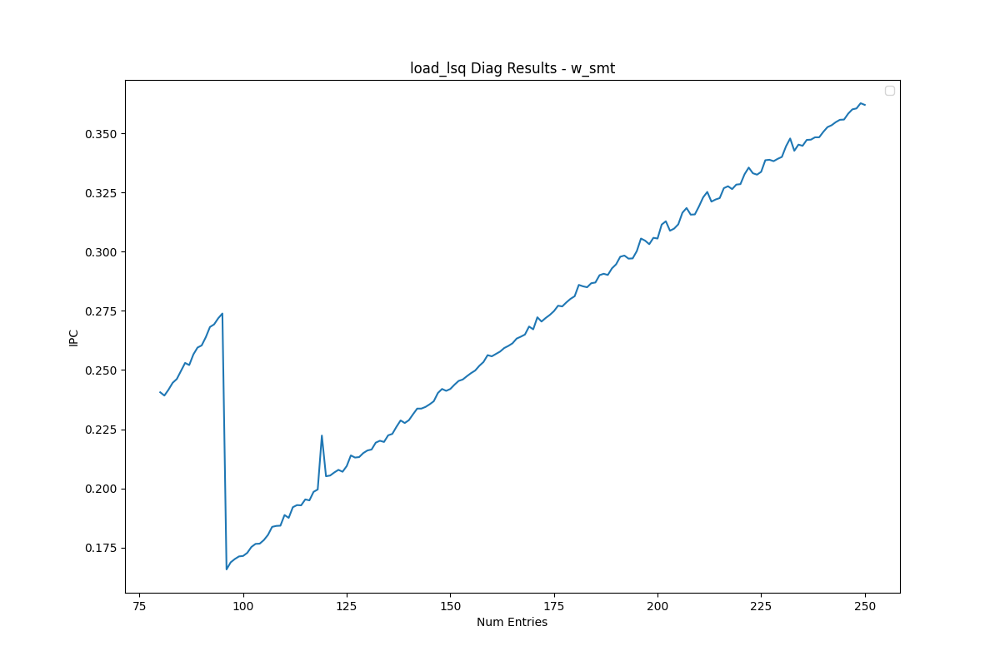

# Load Queue Analysis

This document presents the reverse-engineering results for the load queue.

<table>
  <tr>
    <td></td>
    <td></td>
  </tr>
</table>

## Observations

- As shown in the plots above, the performance drop occurs at **192 entries** without SMT, and at **96 entries** with SMT.
- Since the drop point with SMT is exactly half of the full capacity, this indicates **static partitioning**.
- The total size is **192 entries**.