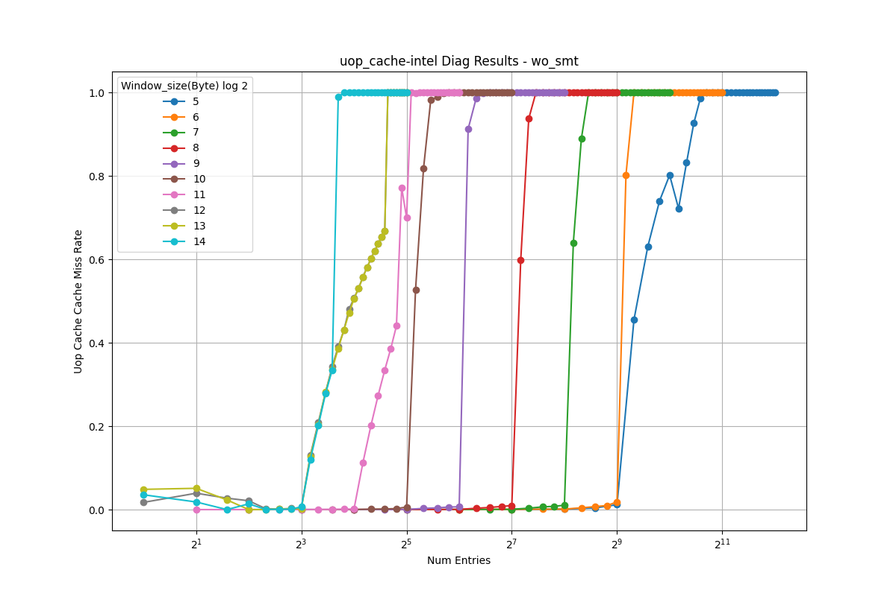
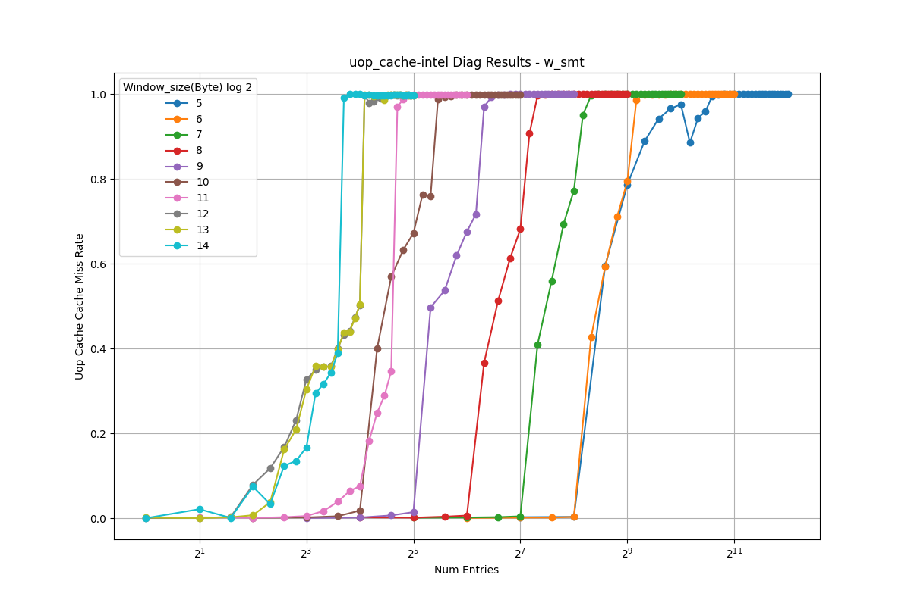

# Micro-op Cache Analysis (Intel)

This document presents the reverse-engineering results for the micro-op (uop) cache.

<table>
  <tr>
    <td></td>
    <td></td>
  </tr>
</table>

## Observations

- As the stride increases, the address bits used for set indexing shift to higher positions. When the stride exceeds the set index range, all accesses map to the same set, causing the performance curves to converge.
- The results show identical behavior for both 32-byte and 64-byte strides, indicating that the actual indexing granularity of the uop cache is **64 bytes**.
- In these results, curves converge at stride 2^12, so the MSB of the set index is at bit position **11** (0-indexed).
- With a 64-byte window size, we exclude the 6-bit offset, leaving **6 bits** for the set index.
- Therefore, the uop cache has **64 sets**.
- With a total of 512 entries, the associativity is **512/64 = 8 ways**.
- Since the entry count with SMT is exactly half of the count without SMT, this indicates **static partitioning**.

---

**NOTE**
- The frontend has latency-hiding mechanisms (e.g., instruction buffer), making it difficult to reverse-engineer using only IPC.
- Therefore, we use Intel-specific  PMU event `IDQ:MITE_UOPS` to detect uop cache misses.